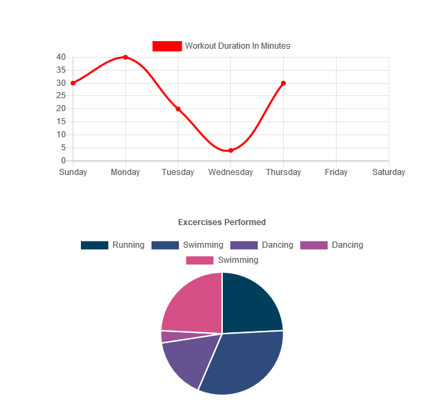

# :running: Fitness Tracker :running:

# Fitness Tracker 
#### Fitness Tracker is an app that allows you to store and save workouts you've completed, and then give you detailed data about your workouts over time.

## Table Of Contents:
  1. Installation 
  2. Testing 
  3. Contributing
  4. License
  5. Questions 

## Installation: 
 You can download this package and run it locally, or you can visit the deployed version here: https://radiant-retreat-88389.herokuapp.com/

## License: 
  

## Questions: 
daneb91@gmail.com 

